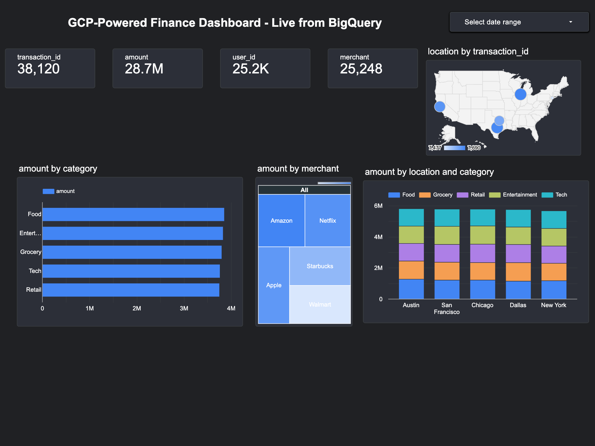

# 🚀 Real-Time Financial Transactions Pipeline on Google Cloud

This project simulates and analyzes real-time financial transactions using a fully serverless architecture on Google Cloud Platform (GCP). It includes data generation, stream ingestion, real-time processing, cloud scheduling, and rich dashboard visualizations with Looker Studio.

---

## 📌 Architecture


---

## 🧱 Tech Stack

- **Google Cloud Pub/Sub** – Streaming message ingestion
- **Cloud Functions** – Data processing and auto transaction publishing
- **BigQuery** – Serverless data warehouse
- **Looker Studio** – Visualization and analytics
- **Cloud Scheduler** – Automating transaction generation
- **Python** – Transaction generator and Cloud Function logic

---

## ⚙️ Project Workflow

1. **Synthetic Data Generator**:
   - Python script (`generate_transactions.py`) simulates realistic financial transactions.
   - Publishes messages to a Pub/Sub topic.

2. **Cloud Function: `process_transaction`**:
   - Triggered by Pub/Sub.
   - Parses transaction messages and stores them into BigQuery.

3. **Cloud Function: `auto_generate_transactions`**:
   - HTTP-triggered function to auto-publish batches of transactions.

4. **Cloud Scheduler**:
   - Triggers `auto_generate_transactions` every minute.

5. **BigQuery Dataset**:
   - Stores structured transaction data for querying and analysis.

6. **Looker Studio Dashboard**:
   - Visualizes key metrics: transaction count, amount trends, merchant categories, heatmaps, and geographic patterns.

---

## 📊 Dashboard Snapshots



📎 [PDF Download of Dashboard](Desktop/gcp-de-project/dashboard/looker_dashboard.pdf)

---

## 📂 Folder Guide

| Folder          | Contents                                              |
|-----------------|-------------------------------------------------------|
| `data_generator/`  | Python script to simulate and publish transactions |
| `cloud_functions/` | Function to process messages and write to BigQuery |
| `auto_generator/`  | Function to auto-trigger message publishing        |
| `dashboard/`       | Dashboard screenshots and PDF export               |
| `architecture/`    | System architecture diagram                        |

---

## 🧠 Key Learnings

- Hands-on experience with serverless data engineering
- Real-time ingestion and processing workflows
- Dashboard design using live BigQuery data
- Automation using Cloud Scheduler

---

## 📌 How to Run Locally

> Prerequisites: GCP account, billing enabled, gcloud CLI, Python 3.10+, BigQuery dataset created

1. **Create virtual environment**
```bash
python3 -m venv venv
source venv/bin/activate
